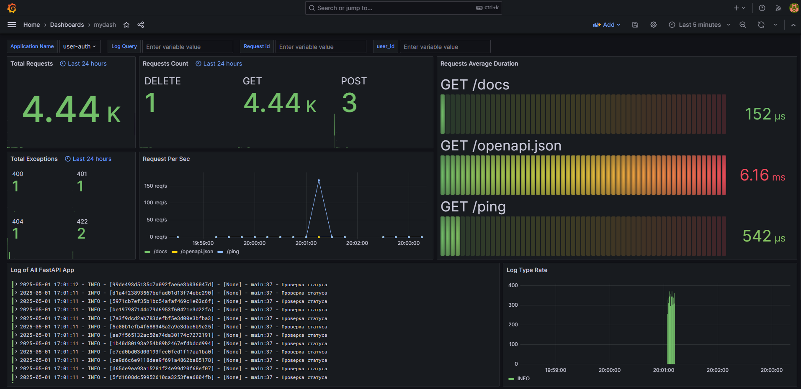

# HRM Microservices Architecture

Проект представляет собой HRM-систему, реализованную на микросервисной архитектуре с использованием **FastAPI**, **Kafka**, **Redis**, **PostgreSQL**, **MongoDB**, **JWT (RSA)**, **Nginx** и системы мониторинга **Prometheus + Grafana + Loki**.

---

## 🧱 Архитектура

### 1. **User-Auth Service**
- FastAPI-приложение для управления пользователями и авторизации.
- PostgreSQL используется как основная база данных.
- JWT-аутентификация с использованием **RSA-ключей**.
- pg_cron для удаления истекших refresh-токенов
- **Redis** применяется для инвалидации access-токенов.

### 2. **Resume Service**
- FastAPI-приложение для хранения и управления резюме пользователей.
- Использует **MongoDB** для хранения документов.

---

## 🔄 Межсервисное взаимодействие

- **Kafka** используется для одного ключевого события:
  - 👉 Удаление пользователя в `user-auth` → Удаление всех резюме в `resume-service`.

---

## 🔐 Авторизация

- JWT реализована на **RSA** (асимметричная криптография).
- Все access-токены валидируются локально, Redis обеспечивает возможность их инвалидации.
- Refresh-токены обновляют access-токены через отдельный endpoint.

---

## 📊 Мониторинг и логгирование

| Компонент   | Назначение                                  |
|-------------|----------------------------------------------|
| Prometheus  | Сбор и хранение метрик                       |
| Grafana     | Визуализация метрик и построение дашбордов   |
| Loki        | Централизованное логгирование из сервисов    |



---

## 🚀 Технологии

| Компонент        | Стек                                          |
|------------------|-----------------------------------------------|
| Web Framework    | FastAPI                                       |
| Базы данных      | PostgreSQL (user-auth), MongoDB (resume)      |
| Инвалидация JWT  | Redis                                         |
| Брокер сообщений | Kafka                                         |
| Аутентификация   | JWT (RSA)                                     |
| Reverse Proxy    | Nginx                                         |
| Мониторинг       | Prometheus + Grafana + Loki                   |
| Документация API | Swagger (FastAPI по умолчанию)                |
| Контейнеризация  | Docker, Docker Compose                        |

---

## 📂 Основная структура проекта

```
.
├── infra/                       # Инфраструктура: Docker, Prometheus, Grafana, Nginx, RSA-ключи
│   ├── docker-compose.yaml
│   ├── poetry.lock              # Зависимости проекта
│   ├── pg_cron/                 # Создание Dockerfile с pg_cron
│   ├── keys/                    # RSA-ключи для JWT
│   └── logs/                    # Логи для Loki
│
├── services/
│   ├── user_auth/               # Микросервис авторизации
│   │   ├── alembic/             # Миграции
│   │   ├── auth/                # Логика авторизации (JWT, refresh и т.п.)
│   │   ├── database/            # SQLAlchemy модели и сессия
│   │   ├── kafka_client/        # Kafka producer (удаление пользователей)
│   │   ├── redis_client/        # Redis для blacklist токенов
│   │   ├── rank/             
│   │   ├── user/            
│   │   └── main.py           
│   └── resume/                 # Микросервис резюме
│       ├── kafka_client/       # Kafka consumer (удаление резюме)
│       ├── redis_client/       
│       ├── resume/         
│       └── main.py             
│
├── .gitignore
├── readme.md
```
---

## 🛠 В планах

- 🔄 Настройка CI/CD пайплайна для автоматического развертывания  
- 🛠 Интеграция с Kubernetes для управления контейнерами и масштабируемостью  

---